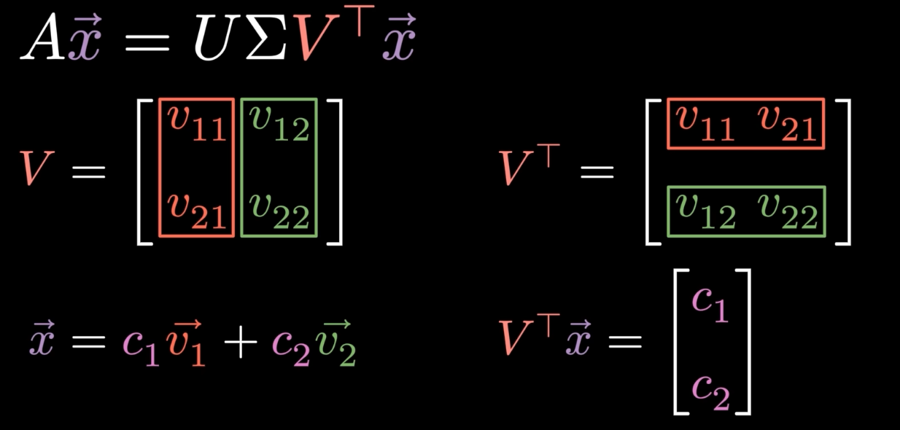
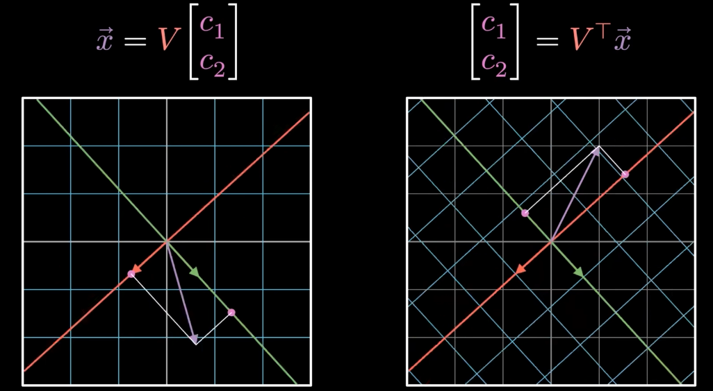
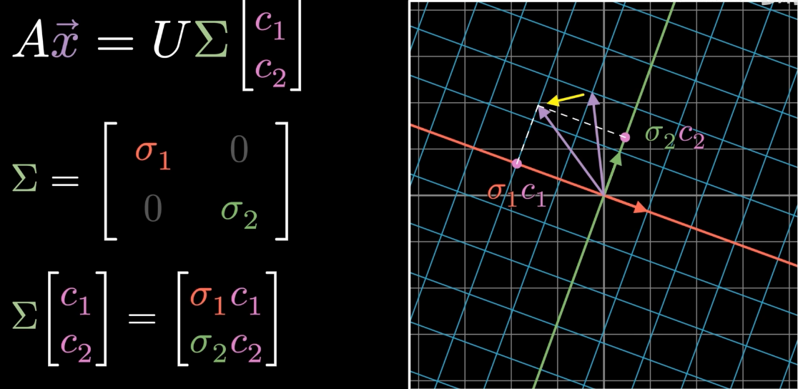
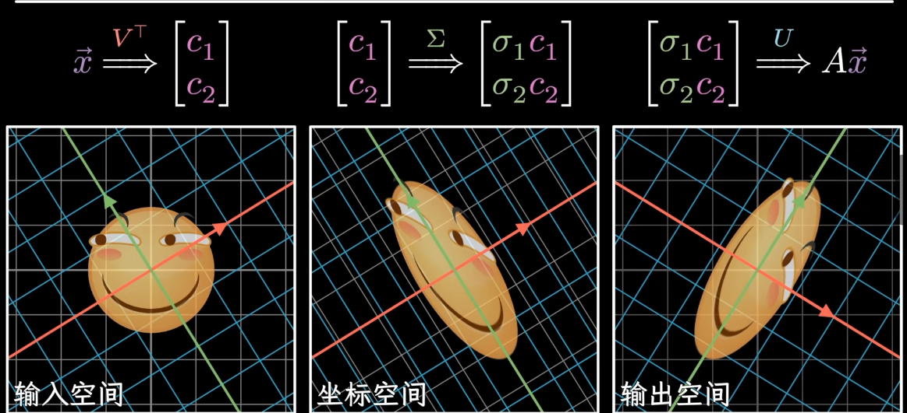

<!--
 * @Author: Nagisa 2964793117@qq.com
 * @Date: 2026-03-15 19:58:44
 * @LastEditors: Nagisa 2964793117@qq.com
 * @LastEditTime: 2026-03-18 14:46:56
 * @FilePath: \nagisa_blog\source\_posts\CoT.md
 * @Description: 这是默认设置,请设置`customMade`, 打开koroFileHeader查看配置 进行设置: https://github.com/OBKoro1/koro1FileHeader/wiki/%E9%85%8D%E7%BD%AE
-->
---
title: LoRA：用小抄、上大分
categories: 
  - LLM
  - 技术
  - AI
  - LoRA
tags: [LLM,AI,LoRA,微调技术]
date: 2026-03-17
---

  LoRA（Low-rank adaptation）微调技术：用小抄、上大分

# LoRA为何出现？
随着GPT-3等千亿参数大模型的出现，越来越多的产业需要使用这些大模型进行生产工作。当把一个**预训练完的大语言模型**接入到**特定垂直领域**进行使用时，往往希望其拥有更多该领域的相关知识，以提升其在该领域的表现。因此，我们需要对预训练的大模型进行**微调**（Fine-tuning）。
## 微调方式
在LoRA出现之前，微调大模型的方式主要有两种：

### 全参数微调
- 直接对预训练模型的所有参数进行微调。对于**参数爆炸的大模型**来说，这种方式需要**大量的计算资源（显存）**和**存储空间**，且容易过拟合。
### 参数高效微调PEFT（Parameter-Efficient Fine-tuning）
- Adapter（适配器层）：在预训练模型的基础上插入小型的适配器层，只微调这些适配器层的参数，保持原模型参数不变、相当于冻结原模型参数，只更新适配器层参数。
  - Pros：  
    - 参数高效：适配器层**参数远少于全模型参数**，显著降低微调的计算资源和存储需求。
    - **避免灾难性遗忘**：**冻结**原模型参数，保留预训练知识，减少过拟合风险。且性能与全参数微调近似。
- Cons：
  - 增加推理延迟：数据前向传播时需要经过适配器层，增加了计算步骤，导致**推理速度变慢**，在工业部署中难以接受。
- Prefix-tuning（前缀微调）：在Transformer模型每层注意力机制Key与Value前拼接连续、可训练的虚拟前缀向量，只微调这些前缀向量的参数，保持原模型参数不变、相当于**冻结原模型参数**，只**更新前缀向量参数**。
  - Pros：  
    - 参数高效：前缀向量**参数远少于全模型参数、比adapter更少**，显著降低微调的计算资源和存储需求。且拥有adapter的大部分优点。
  - Cons：
    - 挤占上下文窗口：前缀向量占用Transformer模型的上下文窗口，减少了模型可用于输入文本的上下文长度，限制了模型处理长文本的能力。
    - 训练难度较大：**虚拟前缀向量学习提示词极不稳定**，训练过程极其**依赖学习率和初始化参数设置**，且需要更多的训练步骤才能达到与全参数微调相近的性能。

# LoRA的出现
为了解决上述全参数微调和PEFT方法的缺点，LoRA（Low-rank adaptation）微调技术应运而生。
> LoRA的**核心思想**是：**冻结预训练模型的原始权重参数**，旁开一个**并联矩阵**来学习权重的更新，并将旁路矩阵进行**低秩分解**，从而大幅减少微调时需要更新的参数数量。
## 解答你对LoRA开挂的疑问
### 为什么可以对增量权重进行低秩分解？  
- 低秩分解的本质是将一个高维矩阵近似表示为两个低维矩阵的乘积。
- 对于大模型的权重更新，**增量权重**通常具有**较低的秩**
  - 因为微调过程中模型只需要学习一些**特定任务**相关的**特征**，而不是完全重新学习所有参数。因此，增量权重中很多维度是**冗余**的，有效信息往往集中在较低维度的子空间中。
- 通过低秩分解，LoRA可以把一个**高维矩阵**近似表示为**两个低维矩阵的乘积**，从而**大幅减少**需要更新的参数数量，同时保留了足够的表达能力来适应特定任务。
  - 让我们举个例子说明一下：假设我们有一个权重矩阵W，维度为1000x1000，即包含100万个参数。我们想要微调这个矩阵，但我们发现增量权重的秩只有10，这意味着我们可以用两个低秩矩阵A和B来近似表示增量权重，其中A的维度为1000x10，B的维度为10x1000。这样，我们只需要更新A和B这两个矩阵的参数，总共只有20,000个参数，而不是原来的100万个参数，从而大幅减少了微调时需要更新的参数数量。 
### 为什么低秩分解可以保持模型性能？——奇异值分解（SVD）理论
- **奇异值分解（SVD）是矩阵分解的一种方法**，可以将一个矩阵分解为**三个矩阵的乘积**：$\text U$、$\text Σ$和$\text V^T$，其中$\text U$和$\text V$是正交矩阵，$\text Σ$是一个对角矩阵，包含了原矩阵的奇异值。
  - 让我们来复习一下**线性代数**
  - **图一**展示了当向量$\text X$左乘正交矩阵$\text V$时的情况：相当于将向量$\text X$投影到正交列向量（正交基底）$\text V$矩阵的**正交坐标系**上
  - **图二**则展示了左乘$\text V$可将坐标转化为新映射向量，左乘$\text V^T$则可以把向量新映射正交坐标系下的坐标
  - **图三**展示了$\text Σ$对角矩阵的作用：**拉伸和压缩新正交坐标系**
  - **图四**则展示了完整的SVD分解过程
  - 具体的SVD细节推荐[bilibili讲的很好的漫士沉思录老师的视频(也是上述图的截图出处)](https://www.bilibili.com/video/BV1XcfiBeEwQ/)此处不做过多赘述。
- 让我们举例说明一下：观察如下矩阵$$A = \begin{bmatrix}
5.0 & 4.0 & 1.0 & 0.5 \\
4.5 & 5.0 & 0.5 & 1.0 \\
0.5 & 1.0 & 5.0 & 4.0 \\
1.0 & 0.5 & 4.0 & 5.0 \\
4.0 & 4.0 & 4.0 & 4.0
\end{bmatrix}$$
  - 我们对矩阵 $A$ 进行 SVD 分解（$A = U \Sigma V^T$），提取出它的奇异值矩阵 $\Sigma$
  $$\Sigma = \begin{bmatrix}
13.30 & 0 & 0 & 0 \\
0 & 7.63 & 0 & 0 \\
0 & 0 & 1.13 & 0 \\
0 & 0 & 0 & 0.89
\end{bmatrix}$$
  - 如果我们计算前两个奇异值包含的**信息量占比**：$$\frac{\sigma_1^2 + \sigma_2^2}{\sigma_1^2 + \sigma_2^2 + \sigma_3^2 + \sigma_4^2} \approx \frac{177.0 + 58.2}{177.0 + 58.2 + 1.3 + 0.8} \approx 99.1\%$$
  - 低秩近似处理，即**保留前两个较大的奇异值，舍弃后两个较小的奇异值**，我们可以得到一个近似矩阵$$\Sigma' = \begin{bmatrix}
13.30 & 0 & 0 & 0 \\
0 & 7.63 & 0 & 0 \\
0 & 0 & 0 & 0 \\
0 & 0 & 0 & 0
\end{bmatrix}$$
  - 用这个被截断的$\Sigma'$去反向重构矩阵，得到**低秩近似矩阵** $A'$（即 $A' = U \Sigma' V^T$）：$$A' = \begin{bmatrix}
4.60 & 4.42 & 0.74 & 0.75 \\
4.84 & 4.65 & 0.75 & 0.76 \\
0.72 & 0.76 & 4.50 & 4.50 \\
0.74 & 0.78 & 4.50 & 4.50 \\
4.05 & 3.94 & 4.00 & 4.00
\end{bmatrix}$$
- 总结：通过SVD分解的$\text Σ$（即奇异值矩阵），我们可以**得知所有的奇异值**，现实生活中的矩阵**往往满秩**，但**大部分奇异值较小，较小的奇异值近似与0，处理时可令矩阵减去此秩，矩阵的秩自然下降**，这意味着矩阵的有效信息主要集中在**前几个较大的奇异值对应的维度**上。因此，我们可以通过保留些个**较大的奇异值**来近似原矩阵，从而实现低秩分解，同时保持模型性能。
### 所以LoRA到底如何实现？
- LoRA核心逻辑是**事前假设**：它直接假设我们要学习的“新知识”本身就是**低秩的**，所以**干脆不生成大矩阵**，直接用两个小矩阵相乘来“拼”出这个**低秩矩阵**，从而**大幅减少**需要更新的参数数量。即将一个$d \times k$的矩阵分解为一个$d \times r$的矩阵$B$和一个$r \times k$的矩阵$A$，其中$r$为你自己选择的**缩小后的矩阵的秩**，远小于$d$和$k$。
- LoRA的设定中，**权重的更新公式**为：$$W_{\text{new}} = W_0 + \Delta W = W_0 + B A$$
  - $B$和$A$的乘积$BA$就是用来完美平替 SVD 截断重构出来的那个低秩矩阵的。
    - 矩阵$B$：负责降维后的“列空间”，你可以把它粗略类比为SVD中的$\text U$。
    - 矩阵$A$：负责降维后的“行空间”，你可以把它类比为SVD中的$\text V^T$。
  - LoRA 中，没有显式的$\Sigma$。
    - $A$和$B$ 是神经网络通过**反向传播**出来的。在训练过程中，神经网络会自动把各个维度的**奇异值的作用**吸收到 $A$ 和 $B$ 具体的数值里。不需要像 SVD那样先分解再截断，网络自己就会学出一个最优的低秩结构。
# LoRA的流程
| 步骤 | 操作 |
| :--- | :--- |
| **1. 初始化** | • **$W$**: 使用预训练权重，冻结梯度计算 • **$A$**: 小高斯噪声初始化（如 $\mathcal{N}(0,0.02)$） • **$B$**: 全零初始化，确保初始 $\Delta W=0$，不干扰原模型 |
| **2. 前向传播** | 输入数据 $X$ $\rightarrow$ 经 $W_{eff} = W + A \times B$ $\rightarrow$ 输出 $\rightarrow$ 计算损失 $L$ |
| **3. 反向传播** | 计算损失 $L$ 对 $A$ 和 $B$ 的梯度 不计算被冻结的**原始近满秩矩阵** $W$ 的梯度 |
| **4. 参数更新** | 使用优化器（如 Adam）仅更新 $A$ 和 $B$ |
| **5. 迭代优化** | 重复步骤 2-4，直到损失收敛或达到训练轮次 |
- 综上，你已经入门成为一位LoRA微调技术的开发者了，接下来就可以去**实践一下**了！附笔者使用的北航开源的[LlamaFactory](https://github.com/hiyouga/LlamaFactory)