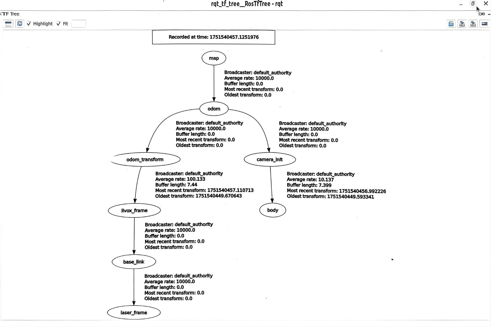
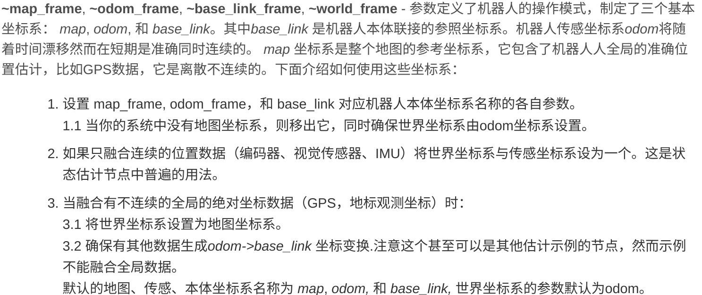

  机器人定位基础（算法组第八课）

# 前言
- 机器人定位是在给定环境中，机器人通过对环境数据的感知，估计自身在环境中的位置和姿态的过程

- 机器人定位大致分为两大类：相对定位和绝对定位

- 相对定位是通过机器人自身的传感器数据（如里程计、IMU等）来估计位置变化，所有获得的信息都是以当下位置为基准的相对变化，无法获得绝对位置，容易积累误差

> 常见的相对定位有：轮式编码器、惯性测量单元（IMU）、视觉图像辅助定位等。他们的优点是实时性好，且对***环境要求不高***，即使在噪声多的情况下也能够做到**不“突变”产生较大的测量误差**，但是他会随着系统的运行累计小的误差，最终导致**误差积累**，产生较大漂移

- 绝对定位是通过外部环境的特征（如视觉标志物、激光地图等）来确定机器人在环境中的绝对位置，能够提供全局一致的位置估计，误差较小，但是实现较为复杂

> 常见的绝对定位有：**SLAM**（simultaneous localization and mapping）、重定位（Relocation）、视觉里程计（Visual Odometry）等。他们的优点是能够提供全局一致的位置估计，误差较小，但对**环境要求较高**，且***计算复杂度***较大

- 本篇旨在介绍绝对定位的基础知识，并介绍一些绝对定位方法（尤其是***SLAM***）常常用到的基础技能

# ROS与机器人定位

## TF树坐标管理
- TF树（Transform Tree）是在机器人操作系统（ROS）中使用的一种数据结构，用于跟踪和管理多个坐标系之间的关系，在ROS1中为tf,在ROS2中为tf2。
- 用户可以定义坐标系（如机器人各部分或传感器）之间的相对位置和方向，并能随时间动态更新这些关系。**你可以自行堆叠坐标系树，即可以将一个坐标进行任意坐标系下的变换**
- **TF树**一般**如下图所示**：

- 通过TF树，你可以将安装在机器人上不同位置的传感器数据转换到***统一的坐标系***下，方便进行数据融合和处理。 ***（对于定位算法而言，统一坐标系下的数据处理是非常重要的）***
- 当你开始攥写自己的TF树，建议是**用C++攥写**。~~Python中导入sensor_msgs等包时会有模块导入问题（待确认）~~
- **常用的TF树坐标系**有：

### 动态与静态TF
- 动态TF是以一定的频率不断刷新发布的新TF,适用于机器人运动过程中**不断变化**的一段TF关系的维护和发布（通常用于***机器人上电点***到运行过程中的***任意时刻的位置点***的位置关系维护）
- 静态TF是一次性发布的TF,适用于机器人各个部分之间相对位置**固定不变**的TF关系的维护和发布（通常用于**传感器之间，传感器与车体中心，出发点与地图原点**这种固定的位置关系维护）

## SLAM
- SLAM（Simultaneous Localization and Mapping）是一种让机器人在未知环境中**同时构建地图并定位自身位置**的技术。

### SLAM的数据源和运作原理
- SLAM通常依赖于多种传感器数据，如**激光雷达**（LiDAR）、**摄像头**（单目、双目或RGB-D）、**惯性测量单元**（IMU）、GPS等，来感知环境和估计自身运动。

- 我们用到的激光SLAM的数据源基本只有两种，一种是**激光雷达**，另一种是**IMU**。激光雷达提供环境的**点云数据（PointCloud2）**，IMU提供机器人的加速度和角速度的**位姿信息**。

- SLAM通过上述的传感器数据，进行当前传感器返回数据的**地图构建**并且可以和**已有地图的进行匹配（回环检测Loop Detection）**，从而估计机器人的位置和姿态。

### 重定位以及多功能SLAM实现原理
- 重定位（Relocation）是指机器人在**已经构建好的地图中**，通过传感器数据来确定自身在地图中的位置和姿态的过程。并且**多功能SLAM**支持无论是**构建地图**还是**使用已有地图进行重定位**。

- 首先通过**建图算法**建立环境的地图，然后在**重定位阶段**，机器人通过传感器数据与已有地图进行匹配，来确定自身在地图中的位置和姿态。作业任务中的[Voxel-SLAM](https://github.com/hku-mars/Voxel-SLAM)就是多功能SLAM的一个例子。

### SLAM的优缺点
- 优点：
  - **实时性**：SLAM算法能够在机器人运动过程中实时构建地图并定位，适用于动态环境
  - **全局性**：SLAM能够提供全局一致的地图和定位信息，减少累积误差

- 同时也有一些缺点：
  - **环境依赖性强**：SLAM的性能对环境依赖十分强，在**特征稀少会导致严重漂移（SLAM退化）**
  - **数据依赖度高**：纯SLAM（不加上任何纠正方式），对初始位姿数据要求极高，微小的初始误差会导致整个地图的严重漂移
  - **计算复杂度高**：SLAM算法通常计算复杂度较高，对计算资源要求较高
  - **惧怕机器人的剧烈运动**，尤其是**激光SLAM**，SLAM在机器人剧烈运动时大概率会导致短时间的***严重漂移，从而导致程序直接起飞***

## 数据融合
- 数据融合的原因是为了解决单一**传感器采集数据的局限性**，通过融合多种传感器的数据，可以给定位提供**更加全面和准确的数据**

- 目前还没有实践过数据融合的内容，数据融合涉及到传感器的**时间同步**，**数据对齐**，**融合算法**等多个方面的内容。
