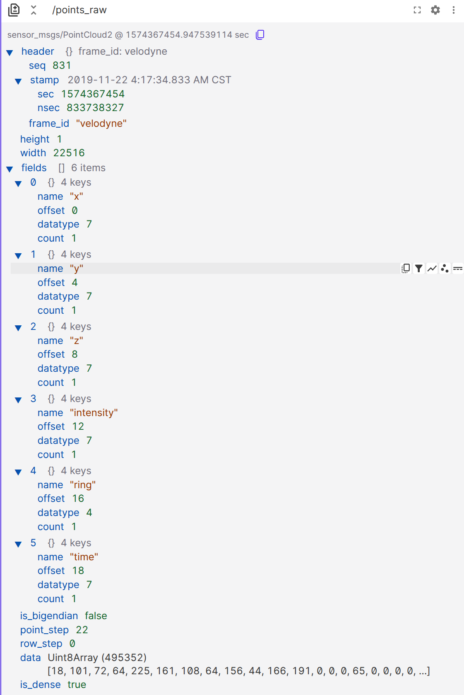
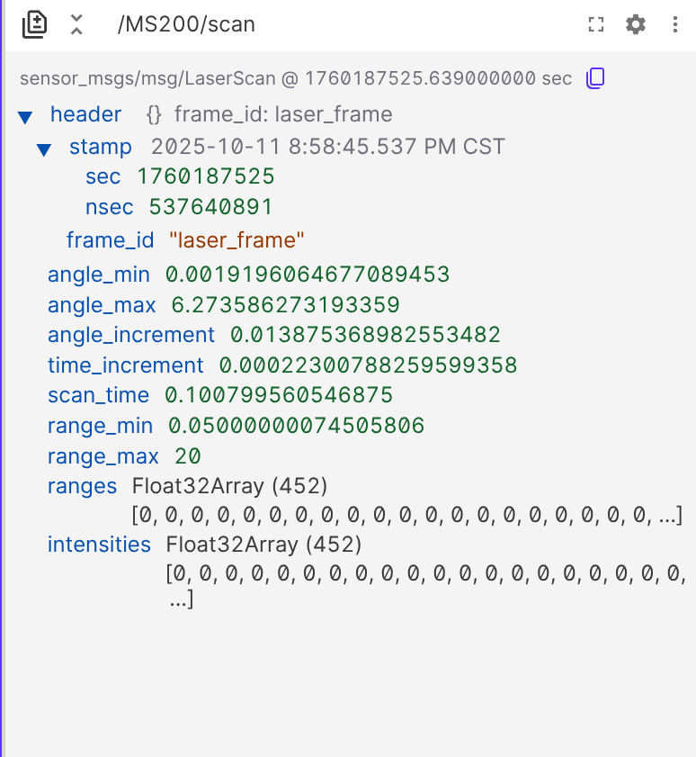
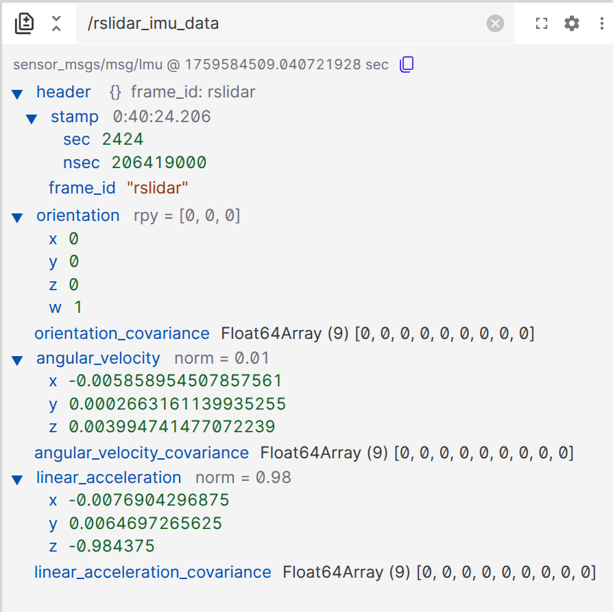

<div align="center" style="font-size: 36px; font-weight: 800;">
  ROS中常见传感器消息和Linux的设备管理
</div>

# [ROS中常见传感器消息——SensorMsg](https://docs.ros.org/en/noetic/api/sensor_msgs/html/index-msg.html)
SensorMsg是ROS中用于表示各种传感器数据的消息类型集合。它包含了多种传感器数据格式，如图像、点云、激光扫描等，方便开发者在ROS环境中处理和传输传感器数据。

## 激光雷达传感器信息
> 你是否也有这样的疑惑，pointcloud2的点云消息格式（sensormsgs）和Velodyne 点云结构（velodyne_ros::Point）Livox 点云结构（livox_ros::Point）有什么联系和区别？CustomMsgs又是什么，为什么要进行雷达点的格式转换？

### [点云消息格式（PointCloud2）](https://docs.ros.org/en/noetic/api/sensor_msgs/html/msg/PointCloud2.html)的解析和理解

- 让我们以**一帧Velodyne点云数据**为例，来解析一下点云消息格式PointCloud2的结构和内容
  - `header`：包含消息的元数据，时间戳与坐标系信息
  - `height`和`width`：表示点云的尺寸，对于非组织化点云，height为1，width为点的数量
  - `fields`：描述点云中每个点的属性，这个fields中包括了不同雷达驱动的***雷达点Point格式***，对于不同型号雷达而言，fields中的内容不同
  - `is_bigendian`：指示数据是否采用大端字节序，通常为false（小端字节序）
  - `point_step`：每个点的字节数，***对于SDK直驱的点云数据为fields中所有属性的字节数之和。但如果存在雷达的点格式转换（如Livox——>Velodyne）则可能在处理时出现了字节空余和对齐的问题，如下图为将Livox_Point转为了Velodyne_Point后的点云数据，其point_step从22扩成了32***

- 给出velodyne点云和livox点云的***fields字段表格***

| Velodyne Point |  Livox Point  |
| :--------------: | :-------------: |
| x   | x  |
| y   | y  |
| z   | z  |
| intensity  | intensity |
| time  | tag  |
| ring | line  |
|  | timestamp |

- 并且在fields的每个属性中，还包含了`offset`（偏移量）、`datatype`（数据类型）、`count`（数量）等信息
  - `offset`：表示该属性在每个点数据中的字节偏移量
  - `datatype`：表示该属性的数据类型，并给出对应的数值对应表格

| 数据类型 | 说明 | 字节数 | datatype数值 |
| :------: | :--: | :----: | :----: |
| INT8 | 8位有符号整数 | 1 | 1 |
| UINT8 | 8位无符号整数 | 1 | 2 |
| INT16 | 16位有符号整数 | 2 | 3 |
| UINT16 | 16位无符号整数 | 2 | 4 |
| INT32 | 32位有符号整数 | 4 | 5 |
| UINT32 | 32位无符号整数 | 4 | 6 |
| FLOAT32 | 32位浮点数 | 4 | 7 |
| FLOAT64 | 64位浮点数 | 8 | 8 |

  - `count`：表示该属性的数量，通常为单元素
> 所以回到我们开始时候的问题，PointCloud2的点云消息格式是**ROS中用于传输激光雷达一次发送来的所有点的消息格式**，而每帧PointCloud2里又**包括了成千上万个因雷达型号而异的雷达点Point格式**，集中体现在PointCloud2的**fields字段**中。这就是不同雷达点格式和PointCloud2点云消息格式的联系和区别。
- 请注意，这个地方写的如此细致的原因，是因为对于 **[ROS桥接与通信](https://tlf-nagisa-blog.com/2025/09/06/workflow/)和[SLAM](https://tlf-nagisa-blog.com/2025/03/18/slam1/)，导航等应用而言** ，***点云格式转化以及雷达点格式转化有时是无法避免的***

## 线雷达传感器信息
### [激光扫描消息格式（LaserScan）](https://docs.ros.org/en/noetic/api/sensor_msgs/html/msg/LaserScan.html)

- 以一帧ms200的线雷达数据作为例子
  - `header`：包含消息的元数据，时间戳与坐标系TF信息
  - `angle_min`和`angle_max`：表示激光扫描的起始和结束角度，单位为弧度，此处几乎为0-2π
  - `angle_increment`：表示每个测量点之间的角度增量，单位为弧度
  - `time_increment`：表示每个测量点之间的时间增量，单位为秒
  - `scan_time`：表示完成一次完整扫描所需的时间，单位为秒
  - `range_min`和`range_max`：表示激光雷达能够测量的最小和最大距离，单位为米
  - `ranges`：一个数组，包含了每个测量点的距离值，单位为米
  - `intensities`：一个数组，包含了每个测量点的强度值
- 每**经过一次scan_time**时间，激光雷达会完成一次angle_min到max的扫描（即防错机制），并生成一帧LaserScan消息。
- 使得LaserScan可以展现外部环境的原因主要是ranges和intensities数组，**前者表示了雷达扫描到的距离信息变化，后者表示了雷达扫描到的反射强度信息变化**

## IMU传感器消息
### [IMU消息格式（Imu）](https://docs.ros.org/en/noetic/api/sensor_msgs/html/msg/Imu.html)

- 以一帧**Robosense的airy雷达**的IMU数据作为例子
  - `header`：包含消息的元数据，时间戳与坐标系TF信息
  - `orientation`：表示IMU的姿态信息，通常以四元数形式表示，包括x、y、z、w四个分量
  - `orientation_covariance`：表示姿态信息的协方差矩阵，描述了姿态测量的不确定性
  - `angular_velocity`：表示IMU的角速度信息，包括绕x、y、z轴的旋转速度，单位为弧度每秒（rad/s）
  - `angular_velocity_covariance`：表示角速度信息的协方差矩阵，描述了角速度测量的不确定性
  - `linear_acceleration`：表示IMU的线性加速度信息，包括沿x、y、z轴的加速度，***单位因雷达型号而异，在Robosense的airy雷达和Livox的Mid360中均为g*** （重力加速度），而在其他型号中可能为m/s²
  - `linear_acceleration_covariance`：表示线性加速度信息的协方差矩阵，描述了线性加速度测量的不确定性
- ROS下的***IMU消息坐标确定——linear_acceleration和angular_velocity***

### IMU的坐标系确定
#### IMU的linear_acceleration正方向确定
> 如何找到IMU消息的坐标系？通常采用重力测量方法
- 让IMU静止放置，测量其线性加速度linear_acceleration，寻找哪个轴的linear_acceleration数值接近重力加速度的值，如果是负值，那么z轴正方向向下，如果是正值，那么z轴正方向向上。即z轴正方向与-9.8数值方向（如果单位为g则为0.98左右）一致。
> 原因在于，***IMU测量不到场力，只能测量非惯性力***。所以他测的实际上是平衡重力的向上支持力，因而得到了一个负数，所以z轴正方向向下。
- 测量其他轴的方法，可以采用roll和pitch的旋转方法，来确定x轴和y轴的正方向，原理同z轴正方向寻找。
#### IMU的angular_velocity正方向确定
- 当你确定了IMU的linear_acceleration坐标系后，**angular_velocity的正方向就可以通过右手定则**来确定。即用大拇指指向linear_acceleration的正方向，四指弯曲的方向即为angular_velocity的对应x，y，z轴的正方向。

## [ROS留给你的礼物CustomMsgs](https://docs.ros.org/en/foxy/Tutorials/Beginner-Client-Libraries/Custom-ROS2-Interfaces.html)
- 你是否也有这样的疑惑，为什么有些雷达驱动发布的点云消息格式是sensor_msgs/PointCloud2，而有些雷达驱动发布的点云消息格式却是自定义的CustomMsgs/Point？
- 其实，CustomMsgs是ROS中允许用户自定义消息类型的机制。用户可以根据自己的需求，定义适合特定应用场景的消息格式。
- 对于[Livox系列雷达](https://github.com/Livox-SDK/livox_ros_driver/tree/master/livox_ros_driver/msg)，他们就采用了**自定义的点云消息格式（CustomMsg.msg）和自定义的内含自定义雷达点格式（CustomPoint.msg）来发布点云数据。**
### 如果你也想自定义消息格式：
- 在构建ROS功能包时，首先多添加message_generation、message_runtime的依赖
- 创建msg文件夹，并在其中定义你的消息内容与格式
- 在CMakeLists.txt中，添加对**自定义消息的编译和生成支持**
```cmake
find_package(catkin REQUIRED COMPONENTS
	roscpp
	rospy
	sensor_msgs
	std_msgs
	message_generation # 添加消息生成的依赖
	rosbag
	pcl_ros
	)

## Generate messages in the 'msg' folder 将自定义消息构建
add_message_files(FILES
	CustomPoint.msg
	CustomMsg.msg
#   Message2.msg
	)

generate_messages(DEPENDENCIES
	std_msgs
	)
# ！！generate_messages中指定你所构建的消息需要依赖的其他消息类型
```

- 在package.xml中，声明对**消息生成和运行时的依赖**
```xml
  <build_depend>roscpp</build_depend>
  <build_depend>rospy</build_depend>
  <build_depend>std_msgs</build_depend>
   <!-- 依赖项：编译时依赖 -->
  <build_depend>message_generation</build_depend> 
  <build_depend>rosbag</build_depend>
  <build_depend>pcl_ros</build_depend>

  <build_export_depend>roscpp</build_export_depend>
  <build_export_depend>rospy</build_export_depend>
  <build_export_depend>std_msgs</build_export_depend>
  <build_export_depend>rosbag</build_export_depend>
  <build_export_depend>pcl_ros</build_export_depend>

  <exec_depend>roscpp</exec_depend>
  <exec_depend>rospy</exec_depend>
  <exec_depend>std_msgs</exec_depend>
  <!-- 依赖项：运行时依赖 -->
  <exec_depend>message_runtime</exec_depend>
  <exec_depend>rosbag</exec_depend>
  <exec_depend>pcl_ros</exec_depend>
```
- 重新编译功能包后，你就可以在代码中使用自定义的消息类型了

# Linux的设备管理——udev
设置udev规则的本意是**通过 “硬件唯一标识” 精准匹配设备，为其绑定 “永远不变的符号链接” 和 “预设的访问权限”，最终实现 “设备无论插拔顺序如何，程序都能通过固定路径稳定访问” 的目标**
- 从一段**udev规则脚本**说起
```bash
#!/bin/bash

# 获取脚本的绝对路径
SCRIPT_DIR=$(dirname "$(realpath "$0")")
sudo apt-get install v4l-utils
# 避免盲文挤占ch340
sudo apt-get remove brltty 

# 进入脚本同目录下的 librealsense 目录
cd "$SCRIPT_DIR/packages/librealsense"
echo "当前目录: $(pwd)"
./scripts/setup_udev_rules.sh

# 安装奥比中光规则
cd "$SCRIPT_DIR/packages/orbbecSDK/misc/scripts"
echo "当前目录: $(pwd)"
sudo ./install_udev_rules.sh

# 安装 wheel_imu 规则
cd "$SCRIPT_DIR/packages/wheel_imu/fdilink_ahrs_ROS2"
echo "当前目录: $(pwd)"
# sudo ./wheeltec_udev.sh
#增加对轮趣imu (fdilink_arhs)的支持
echo  'KERNEL=="ttyUSB*", ATTRS{idVendor}=="10c4", ATTRS{idProduct}=="ea60",ATTRS{serial}=="0003", MODE:="0777", GROUP:="dialout", SYMLINK+="wheeltec_FDI_IMU_GNSS"' >/etc/udev/rules.d/my_dev.rules

# 添加QinHeng Electronics USB Single Serial规则 (ID 1a86:55d4)
# echo 'KERNEL=="ttyUSB*", ATTRS{idVendor}=="1a86", ATTRS{idProduct}=="55d4", MODE:="0777", GROUP:="dialout", SYMLINK+="qinheng"' >> /etc/udev/rules.d/my_dev.rules
# echo 'KERNEL=="ttyACM*", ATTRS{idVendor}=="1a86", ATTRS{idProduct}=="55d4", MODE:="0777", GROUP:="dialout", SYMLINK+="qinheng"' >> /etc/udev/rules.d/my_dev.rules
echo 'KERNEL=="ttyACM*", ATTRS{idVendor}=="1a86", ATTRS{idProduct}=="55d4", ATTRS{serial}=="5954002901",MODE:="0777", GROUP:="dialout", SYMLINK+="serial_qh"' >> /etc/udev/rules.d/my_dev.rules

# CP210x 规则（精确匹配序列号 "0001"）
echo 'KERNEL=="ttyUSB*", ATTRS{idVendor}=="10c4", ATTRS{idProduct}=="ea60", ATTRS{serial}=="0001", MODE:="0777", GROUP:="dialout", SYMLINK+="cp210x"' >> /etc/udev/rules.d/my_dev.rules

#安装ms_200规则
# 设置设备别名并设置权限
echo 'KERNEL=="ttyUSB*", ATTRS{idVendor}=="1a86", ATTRS{idProduct}=="55d4", MODE:="0777", GROUP:="dialout", SYMLINK+="ms200"' >> /etc/udev/rules.d/my_dev.rules
echo 'KERNEL=="ttyACM*", ATTRS{idVendor}=="1a86", ATTRS{idProduct}=="55d4", MODE:="0777", GROUP:="dialout", SYMLINK+="ms200"' >> /etc/udev/rules.d/my_dev.rules
# echo 'KERNEL=="tty*", ATTRS{idVendor}=="1a86", ATTRS{idProduct}=="55d4", ATTRS{serial}=="597B009268", MODE:="0777", GROUP:="dialout", SYMLINK+="ms200"' >> /etc/udev/rules.d/my_dev.rules

# 为 MS200 设备（如果有不同的序列号）创建 /dev/ms200
# 下位机串口
echo 'KERNEL=="ttyUSB*", ATTRS{idVendor}=="0483", ATTRS{idProduct}=="5740", MODE:="0777", GROUP:="dialout", SYMLINK+="serial_x64"' >> /etc/udev/rules.d/my_dev.rules
echo 'KERNEL=="ttyACM*", ATTRS{idVendor}=="0483", ATTRS{idProduct}=="5740", MODE:="0777", GROUP:="dialout", SYMLINK+="serial_x64"' >> /etc/udev/rules.d/my_dev.rules

echo 'KERNEL=="ttyUSB*", ATTRS{idVendor}=="1a86", ATTRS{idProduct}=="7523", MODE:="0777", GROUP:="dialout", SYMLINK+="serial_ch340"' >> /etc/udev/rules.d/my_dev.rules
echo 'KERNEL=="ttyACM*", ATTRS{idVendor}=="1a86", ATTRS{idProduct}=="7523", MODE:="0777", GROUP:="dialout", SYMLINK+="serial_ch340"' >> /etc/udev/rules.d/my_dev.rules

#添加ch040imu规则
echo 'KERNEL=="ttyUSB*", ATTRS{idVendor}=="10c4", ATTRS{idProduct}=="ea60", \
    ATTRS{serial}=="26454afeb1ebed1181ec429aa88ea882", \
    MODE:="0777", GROUP:="dialout", SYMLINK+="ch040_imu"' >> /etc/udev/rules.d/my_dev.rules
    
echo 'KERNEL=="ttyACM*", ATTRS{idVendor}=="1209", ATTRS{idProduct}=="6666", MODE:="0777", GROUP:="dialout", SYMLINK+="serial_sick"' >> /etc/udev/rules.d/my_dev.rules

service udev reload
sleep 2
service udev restart
```
- 从上面的脚本中，我们可以看到它**主要做了以下几件事**：
  - 安装了一些必要的软件包，如v4l-utils，用于视频设备管理
  - 移除了可能与**某些串口设备冲突**的***brltty软件包***
  - 进入不同的目录，执行了一些udev规则安装脚本，这些脚本通常会为特定的硬件设备添加udev规则
  - 最后，重新加载并重启了udev服务，以确保新的规则生效

## udev的工作原理
- udev通过对KERNEL（内核设备名称）、ATTRS{idVendor}（设备供应商ID）、ATTRS{idProduct}（设备产品ID）、ATTRS{serial}（设备序列号）等属性进行匹配，来识别特定的硬件设备。  
  - KERNEL：表示设备的内核名称模式，通常用于匹配设备文件名，如ttyUSB*表示所有以ttyUSB开头的设备。 **当设备插入时，内核会自动生成一个动态设备节点（如ttyUSB0），udev 监测到这个 “设备插入事件” 后，根据KERNEL规则（如ttyUSB\*）匹配该节点，再结合其他属性（idVendor等）确认设备身份** 。
  - ATTRS{idVendor}：表示设备的供应商ID，是一个唯一标识设备制造商的16进制字符串。可以用来**精准匹配某一品牌的设备**。
  - ATTRS{idProduct}：表示设备的产品ID，是一个唯一标识设备型号的16进制字符串。可以用来**精准匹配某一型号的设备**
  - ATTRS{serial}：表示设备的序列号，是设备的唯一标识符。可以用来**精准匹配某一具体的设备**。
  - 通过遍历所有可能被分配的内核名称（KERNEL），并结合供应商ID、产品ID和序列号等属性，udev能够**唯一且稳定地识别每一个硬件设备**，从而为其分配固定的符号链接。
- 通过设置MODE（设备权限）、GROUP（设备所属用户组）和SYMLINK（符号链接名称）等属性，udev能够**为每个设备分配合适的访问权限和一个永远不变的符号链接**，确保用户和程序能够稳定地访问这些设备。
  - MODE：表示设备文件的权限设置，如0777表示所有用户都具有读写执行权限。可以用来**设置设备的访问权限**。
  - GROUP：表示设备文件所属的用户组，如dialout表示设备属于dialout组。可以用来**设置设备的用户组**。
  - SYMLINK：表示为设备创建的符号链接名称，**若为+=，则表示添加一个新的符号链接** ，可以叠加多个符号名字。
- 创建的udev规则文件通常存放在`/etc/udev/rules.d/`目录下，**执行时机为设备插入或移除时，也可以自行执行上述类型脚本自行reload**
- 当你链接好udev规则后， ***就可以通过你添加的符号链接（如/dev/ms200）来访问设备*** ，而不必担心设备插拔顺序导致的设备节点变化。