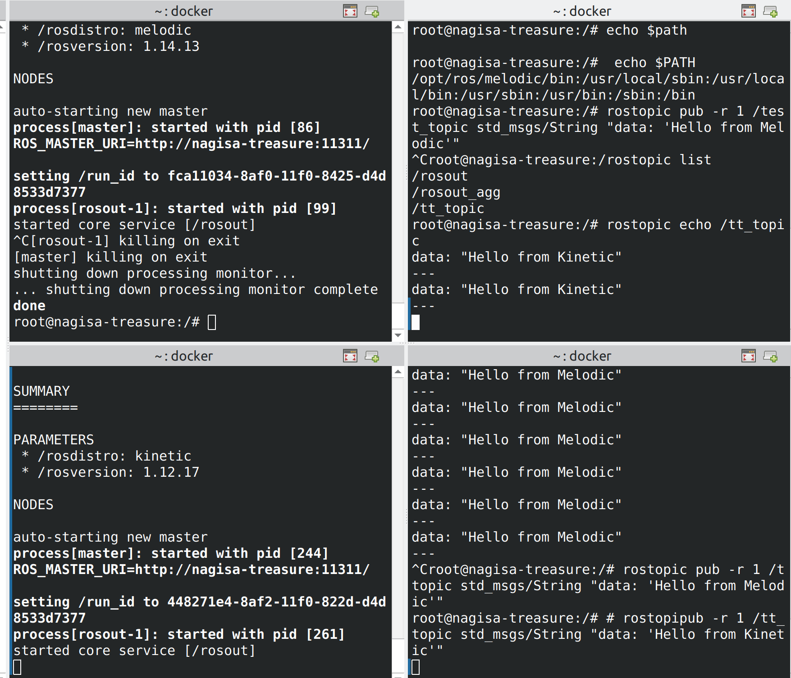

<div align="center" style="font-size: 36px; font-weight: 800;">
  工作流介绍（算法组第六课）
</div>

# [Konsole](https://konsole.kde.org/download.html)的使用
> Ubuntu默认使用**GNOME桌面环境**，同时支持Wayland和X11两种显示服务器协议。KDE桌面环境则是另一种流行的Linux桌面环境，主要使用X11协议，但也支持Wayland。

- Konsole是KDE桌面环境下的终端模拟器，可以类比超级终端（Terminator），但是他拥有更多的快捷键和功能
- Konsole的快捷键和功能可以在设置中进行查看和修改，你能想到的**快速分屏，复制粘贴等快捷键**这里基本都有

- 下载后，需要将Konsole设置为**默认终端模拟器**，输入如下指令后按提示进行：
```bash
sudo update-alternatives --config x-terminal-emulator
```


# 开发容器与[DevContainer](https://code.visualstudio.com/docs/devcontainers/containers)的使用
- **DevContainer**是Visual Studio Code（VS Code）中的一个功能，允许开发者在隔离的容器环境中进行开发。
- 无需在终端进行docker有关的容器**创建和开启等操作**，直接在VS Code中打开项目文件夹，VS Code会自动识别并提示你是否需要使用DevContainer进行开发

## devcontainer的自动识别触发要求
- 首先当然是在vscode中添加devcontainer插件

- 在**项目根目录**下有一个名为`.devcontainer`的文件夹，该文件夹中包含一个`devcontainer.json`文件，并且有Dockerfile或者docker-compose.yml文件来定义容器的配置，若你对Docker和docker-compose不熟悉，建议再去学习一下[相关知识](https://tlf-nagisa-blog.com/2025/03/15/docker1/)

> 项目根目录指的是你vscode**打开文件夹的那一级目录**
- `devcontainer.json`文件中定义了容器的配置选项
```json
{
    "name": "yolo_container",
    "dockerComposeFile": "docker-compose.yml",
    "service": "ros2yolo-service",
    "workspaceFolder": "/home/Nagisa/yolo",
    "shutdownAction": "stopCompose",
    "customizations": {
        "vscode": {
            "extensions": [
                "twxs.cmake",
                "josetr.cmake-language-support-vscode",
                "llvm-vs-code-extensions.vscode-clangd",
                "ms-vscode.cmake-tools",
                "cschlosser.doxdocgen",
                "augustocdias.tasks-shell-input",
                "ms-vscode.cpptools",
                "ms-python.python",
                "ms-iot.vscode-ros",
                "njpwerner.autodocstring",
                "vadimcn.vscode-lldb",
                "llvm-vs-code-extensions.lldb-dap"
            ]
        },
        "jetbrains": {
            "extensions": []
        }
    }
}
``` 
- 通过上面的配置，VS Code会识别并知道你究竟是希望通过dockerfile**构建镜像并用该镜像创建容器**，还是通过docker-compose.yml文件**直接调用已有的镜像来创建容器**
- 本质上来说，`devcontainer.json`文件只是一种配置文件格式，让你可以直接根据配置从vscode中**一键创建容器并进入到容器中**，但你的容器创建和使用的具体细节仍在`docker-compose.yml`中管理

## devcontainer的坑
- 除去docker容器和镜像本身自带的坑，请一定***注意***：当你希望使用上述devcontainer功能时，确保该容器没有已经存在于docker中，即**没有同名的容器**，如果有同名容器，会在vscode时进入时error

- **如果有同名容器**，可以通过docker ps -a查看所有容器，然后docker stop <container_id>停止该容器，最后docker rm <container_id>删除该容器之后再进行上述操作

# ROS1与ROS2通信
- ROS中的信息流以**topic的形式进行传递**，可以将ROS1和ROS2看作两个独立的信息域。
- 当然，如果是**同个容器中的通讯**，直接使用ROS的话题传递即可，此处不作赘述。

## 对于不同版本的ROS通信：当版本全ROS1时（如Kinetic，Melodic等）
- ROS1内部不同版本之间的通信是**基于roscore的**，即**Kinetic与Melodic可以直接通信**，尤其注意这个概念，***宿主机上的本体，包含运行的所有容器中只能存在一个正在运行的roscore***，而ros1的通信就主要依靠与一个全局roscore来进行**话题的传递**

- 笔者在进行ROS1不同版本通信时，只需要其中一个ROS1容器开启roscore，其他ROS1容器就可以直接接收到另一个ROS1容器发布的话题。


## 当为多机ROS1通信时（不重要，且不常用，故略讲）
- 同样允许不同版本的ROS1通信，但是需要配置**ROS_MASTER_URI**和**ROS_HOSTNAME**，虽说是**主机从机的概念，但是其实是双向通信**（细则可以看这篇[帖子](https://www.cnblogs.com/binbin2002/p/18732070)）


## 对于不同版本的ROS通信：当版本全ROS2时（如Foxy，Humble等）
- ***注意！***:涉及到ROS2的通信，存在有若干的深坑。
### 坑总结：ROS2容器与主机（装了ROS2的）的通信正确方式
```yaml
network_mode: host
pid: "host" # 添加 pid 命名空间共享
ipc: "host" # 添加 ipc 命名空间共享 
```
- 1.请确保你的docker-compose.yml中包含网络，pid和ipc的**host共享**，这样**主机与ROS2容器**位于同一网络空间，才可进行通信

- 2.并且需要在ROS2容器中和本机设置一样的***ROS_LOCALHOST_ONLY***，这个环境变量的主要目的是让默认在局域网内广播发送消息的ROS2，变为在本机内广播发送消息。[详细帖](https://blog.csdn.net/qq_35395195/article/details/129529387)

```bash
export ROS_LOCALHOST_ONLY=1 # 在本终端中执行
echo 'export ROS_LOCALHOST_ONLY=1' >> ~/.bashrc # 永久写入，每次进入终端自动执行
```
- 3.请务必确保主机的***UID和GID与容器内的用户UID和GID一致***，否则会出现通信问题，**主机和容器中均使用root也是可以的**，但不推荐，尽量都用**普通用户**。[详细帖](https://blog.csdn.net/weixin_42106287/article/details/148282265)

```bash
id -u # 查看当前用户的UID
id -g # 查看当前用户的GID
```
- 上述每一步都是笔者踩过的一个坑，如果**缺少其中任何一步，都可能会导致ROS2容器与主机通信有问题**

## ~~ROS2的不同版本的容器通信~~(已尝试过，foxy和humble通信是狗屎，humble的多容器通信却是正常的)

- 开启两个不同的基于humble镜像的容器，同样需要设置
```bash
export ROS_LOCALHOST_ONLY=1 # 在本个终端中执行
echo 'export ROS_LOCALHOST_ONLY=1' >> ~/.bashrc # 永久写入，每次进入终端自动执行
```
## [ROS1与ROS2桥接通信](https://github.com/TommyChangUMD/ros-humble-ros1-bridge-builder)
- ROS1与ROS2的通信需要使用桥接包**ros1_bridge**，该桥接包允许在ROS1和ROS2之间传递消息。
- 由于该桥接包本质还是使用的ROS2的通信机制，因此需要确保**ROS2容器与主机的通信正确方式**，即上述的三点
- 具体的安装方式请详见[该仓库readme](https://github.com/TommyChangUMD/ros-humble-ros1-bridge-builder)，该仓库采用的是***镜像编译产生install包***，可以直接使用编译后的**install包进行桥接**
- 编译后的包文件如下

- 其本质是一个挂载在ROS2容器中的桥接节点，**强烈推荐你读完readme复现后**写一个.bash/sh文件将readme教你在包构建之后的流程打包成一个脚本文件一键执行。挂在后台即可进行**Humble和Noetic的桥接**（根据去年的使用经验不一定非得是这两个版本，但是作者是这样写的）